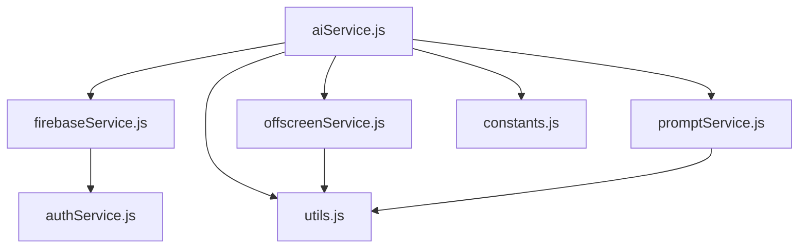
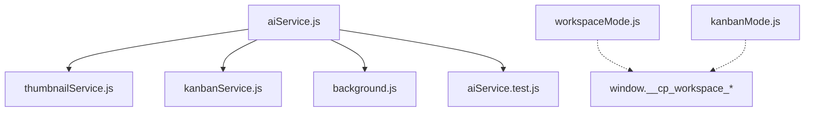

# AI Service 의존성 및 모듈 구조 분석

## 📋 분석 개요

**분석 대상**: `js/services/aiService.js`
**분석 일시**: 2025년 12월 2일
**분석 목적**: 리팩토링 전 의존성 구조 파악 및 순환 참조 확인

---

## 🔗 Import/Export 관계도

### aiService.js의 의존성 (Imports)



#### 상세 Import 목록

| 모듈                  | Import 항목                                                                                      | 용도                            |
| --------------------- | ------------------------------------------------------------------------------------------------ | ------------------------------- |
| `firebaseService.js`  | `getDb`, `CONSTANTS`, `uploadImageToFirebaseStorage`, `cleanDataForFirebase`, `getCurrentUserId` | 데이터베이스 연동, 파일 업로드  |
| `firebaseService.js`  | `ref`, `update`, `get`                                                                           | Firebase Realtime Database 조작 |
| `utils.js`            | `Logger`                                                                                         | 로깅 및 디버깅                  |
| `offscreenService.js` | `sanitizeHtmlInOffscreen`, `cropImageInOffscreen`, `composeThumbnailInOffscreen`                 | HTML 정제, 이미지 처리          |
| `promptService.js`    | `PromptBuilder`, `detectPersona`, `PROMPT_CONFIG`                                                | 프롬프트 생성 및 페르소나 감지  |
| `constants.js`        | `AI_MODELS`                                                                                      | AI 모델 설정 값                 |

### aiService.js의 사용처 (Exports)



#### 상세 Export 목록

| 사용하는 파일         | Import 항목                                                                                                     | 용도                 |
| --------------------- | --------------------------------------------------------------------------------------------------------------- | -------------------- |
| `thumbnailService.js` | `callGeminiAPI`                                                                                                 | AI 이미지 생성       |
| `kanbanService.js`    | `generateIdeaBriefing`                                                                                          | 아이디어 브리핑 생성 |
| `background.js`       | `generateDraftFromIdea`, `generateIdeaBriefing`, `callGeminiAPI`, `generateAiImage`, `postProcessAffiliateHtml` | 백그라운드 작업 처리 |
| `aiService.test.js`   | 전체 모듈                                                                                                       | 단위 테스트          |

---

## 🌐 전역 변수 사용 분석

### window.\__cp_workspace_\* 변수들

**사용 파일들**:

- `js/ui/workspaceMode.js`
- `js/ui/kanbanMode.js`

**변수 목록**:

```javascript
// workspaceMode.js에서 정의 및 사용
window.__cp_workspace_idea_id;
window.__cp_workspace_idea_data;
window.__cp_workspace_save_listener;

// kanbanMode.js에서 사용
window.__cp_workspace_idea_data;
window.__cp_workspace_idea_id;
```

**사용 패턴**:

```javascript
// 정의 (workspaceMode.js)
window.__cp_workspace_idea_id = ideaData.id;
window.__cp_workspace_idea_data = ideaData;

// 사용 (workspaceMode.js 및 kanbanMode.js)
if (window.__cp_workspace_idea_data) {
  // 아이디어 데이터 처리
}
```

**리팩토링 영향도**: ⭐⭐⭐⭐⭐ (매우 높음)

- 전역 변수 제거 또는 모듈화 필요
- 리팩토링 시 상태 관리 방식 변경 필수

---

## 🔄 순환 참조 분석

### 현재 순환 참조 상태: ✅ 안전

```
aiService.js → firebaseService.js → authService.js
                                      ↓
                            utils.js ← promptService.js
                                      ↓
                            offscreenService.js
```

**분석 결과**:

- aiService.js는 다른 서비스들을 import하지만, 다른 서비스들은 aiService.js를 import하지 않음
- firebaseService.js → authService.js → utils.js로의 단방향 의존성
- 순환 참조 없음

### 잠재적 순환 참조 위험

**위험 상황 1**: promptService.js가 aiService.js를 import하는 경우

```javascript
// ❌ 위험한 패턴
// promptService.js
import { callGeminiAPI } from './aiService.js'; // 순환 참조 발생!
```

**위험 상황 2**: offscreenService.js가 aiService.js를 import하는 경우

```javascript
// ❌ 위험한 패턴
// offscreenService.js
import { generateDraftFromIdea } from './aiService.js'; // 순환 참조 발생!
```

---

## 📦 모듈 결합도 분석

### 높은 결합도 모듈들

#### 1. firebaseService.js (⭐⭐⭐⭐⭐)

**결합 이유**: 데이터베이스, 스토리지, 인증을 모두 담당
**현재 사용**: 15개 파일에서 import
**리팩토링 영향**: 매우 높음 - 변경 시 모든 파일 영향

#### 2. utils.js (⭐⭐⭐⭐⭐)

**결합 이유**: Logger, 공통 유틸리티 함수들
**현재 사용**: 20개 이상 파일에서 import
**리팩토링 영향**: 매우 높음

#### 3. aiService.js (⭐⭐⭐⭐)

**결합 이유**: AI 기능의 핵심 허브
**현재 사용**: 4개 파일에서 import
**리팩토링 영향**: 높음 - 주요 기능에 영향

### 낮은 결합도 모듈들

#### 1. promptService.js (⭐⭐)

**결합 이유**: 독립적인 프롬프트 관리
**현재 사용**: 1개 파일에서만 import
**리팩토링 영향**: 낮음

#### 2. offscreenService.js (⭐⭐)

**결합 이유**: DOM 조작 특화
**현재 사용**: 1개 파일에서만 import
**리팩토링 영향**: 낮음

---

## 🏗️ 리팩토링 전략 제안

### Phase 1: 안전한 분리 우선

1. **프롬프트 템플릿 분리** - promptService.js로 이동 (순환 참조 없음)
2. **상수 및 설정 분리** - 별도 config 파일 생성
3. **유틸리티 함수 추출** - aiServiceUtils.js 생성

### Phase 2: 모듈 분해

1. **generateDraftFromIdea 분해**:
   ```javascript
   // 분해 후 구조
   prepareDraftContext(); // 입력 검증 및 컨텍스트 준비
   buildDraftPrompt(); // 프롬프트 생성
   callDraftAPI(); // API 호출
   processDraftResponse(); // 응답 처리
   enhanceDraftWithFeatures(); // 추가 기능 적용
   ```

### Phase 3: 전역 변수 제거

1. **상태 관리 모듈 생성**:
   ```javascript
   // js/services/workspaceState.js
   export class WorkspaceState {
     static getCurrentIdea() {
       /* ... */
     }
     static setCurrentIdea(idea) {
       /* ... */
     }
   }
   ```

### Phase 4: 인터페이스 정리

1. **타입 정의 추가** (JSDoc 또는 TypeScript)
2. **에러 처리 표준화**
3. **로깅 표준화**

---

## ⚠️ 리팩토링 시 주의사항

### 1. 전역 변수 마이그레이션

```javascript
// 기존 코드
window.__cp_workspace_idea_data = ideaData;

// 리팩토링 후
import { WorkspaceState } from './workspaceState.js';
WorkspaceState.setCurrentIdea(ideaData);
```

### 2. Import 경로 유지

- 상대 경로(`./`, `../`)를 절대 경로로 변경하지 말 것
- webpack 번들링에 영향 줄 수 있음

### 3. 테스트 우선

- 각 분리된 모듈마다 단위 테스트 작성
- 통합 테스트로 전체 플로우 검증

### 4. 점진적 배포

- 기능별로 분리하여 배포
- 롤백 계획 수립

---

## 📊 영향도 평가

### 파일별 영향도

| 파일                  | 영향도 | 주요 이유          |
| --------------------- | ------ | ------------------ |
| `aiService.js`        | 높음   | 메인 리팩토링 대상 |
| `firebaseService.js`  | 높음   | 핵심 인프라        |
| `workspaceMode.js`    | 높음   | 전역 변수 사용     |
| `kanbanMode.js`       | 중간   | 전역 변수 사용     |
| `background.js`       | 중간   | 여러 함수 사용     |
| `thumbnailService.js` | 낮음   | 단일 함수만 사용   |
| `kanbanService.js`    | 낮음   | 단일 함수만 사용   |

### 기능별 영향도

| 기능          | 영향도 | 복잡도     |
| ------------- | ------ | ---------- |
| 초안 생성     | 높음   | ⭐⭐⭐⭐⭐ |
| 썸네일 생성   | 높음   | ⭐⭐⭐⭐   |
| 제휴 링크     | 중간   | ⭐⭐⭐     |
| 퍼머링크 생성 | 낮음   | ⭐⭐       |
| JSON-LD 생성  | 낮음   | ⭐⭐       |

---

## 🎯 다음 단계

1. **Phase 1 시작**: 설정 파일과 유틸리티 함수 분리
2. **테스트 케이스 실행**: 현재 기능 테스트로 기준점 설정
3. **점진적 리팩토링**: 작은 단위로 분해하며 테스트 반복
4. **문서화 유지**: 변경사항 지속적 업데이트

---

_이 분석은 리팩토링의 안전성과 효율성을 보장하기 위해 작성되었습니다._
